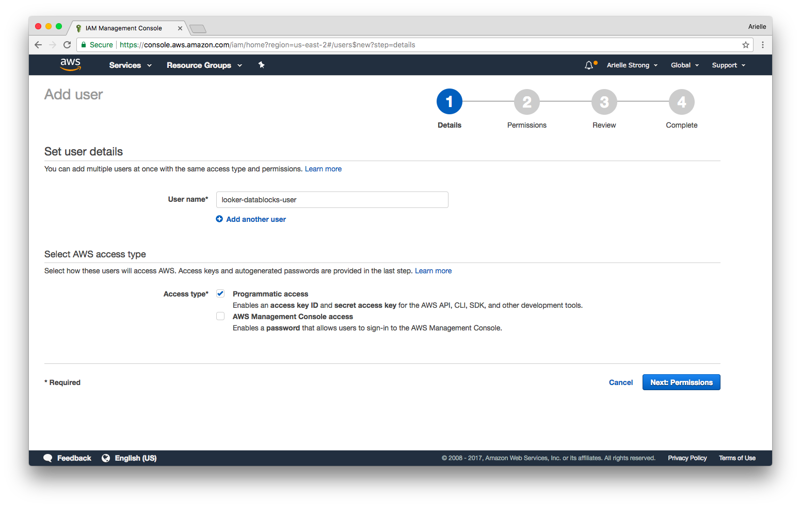
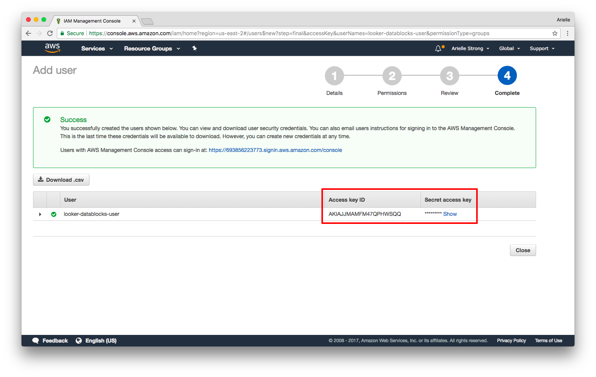
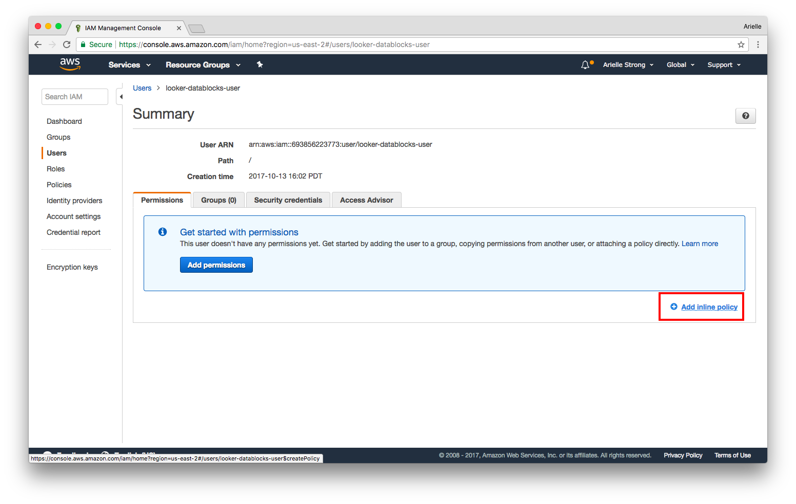
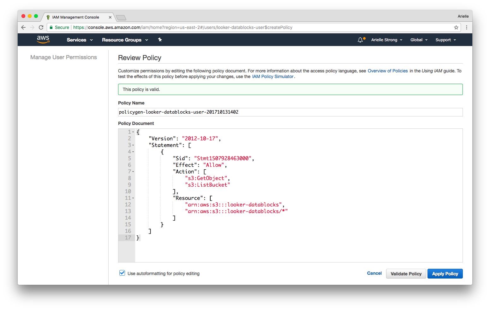

# Get Started

Check out our [**Blocks Directory**](https://looker.com/platform/blocks/directory#data) for a full list of data blocks and use cases

[**Start Modeling**](https://discourse.looker.com/t/data-block-data-block-setup-instructions-and-everything-in-between/5949) by reading through this discourse post.


# DDL Statements

Use the following DDL statements as a *reference and starting point* for uploading our datasets into your own DB.

Note: *Our DDL statments follow Amazon Redshift syntax. You may need to adjust data types and other fields as necessary for your dialect.*

[(jump)](#datablocks-gsod-redshift) **Working with Redshift? Refer to our steps below.**

### Schema

```

CREATE SCHEMA IF NOT EXISTS gsod;

CREATE TABLE GSOD.zcta_distances(
   zip1        VARCHAR  PRIMARY KEY
  ,zip2        VARCHAR
  ,mi_to_zcta5 DOUBLE PRECISION
)
DISTSTYLE EVEN
SORTKEY (zip1, zip2);

CREATE table GSOD.zipcode(
   zip_code  VARCHAR PRIMARY KEY
  ,latitude  DOUBLE PRECISION
  ,longitude DOUBLE PRECISION
  ,city      VARCHAR
  ,state     VARCHAR
  ,county    VARCHAR
)
DISTSTYLE ALL
SORTKEY (zip_code);

CREATE table GSOD.zipcode_station(
   zip_code                      VARCHAR
  ,year                          INTEGER
  ,nearest_station_id            VARCHAR
  ,distance_from_nearest_station DOUBLE PRECISION
)
DISTKEY (zip_code)
SORTKEY (zip_code);


CREATE table GSOD.zcta_county_map(
   zcta5         VARCHAR
  ,state         VARCHAR
  ,county        VARCHAR
  ,geoid         VARCHAR
  ,poppt         VARCHAR
  ,hupt          VARCHAR
  ,areapt        VARCHAR
  ,arealandpt    VARCHAR
  ,zpop          VARCHAR
  ,zhu          VARCHAR
  ,zarea         VARCHAR
  ,zarealand     VARCHAR
  ,copop         VARCHAR
  ,cohu          VARCHAR
  ,coarea        VARCHAR
  ,coarealand    VARCHAR
  ,zpoppct       VARCHAR
  ,zhupct       VARCHAR
  ,zareapct     VARCHAR
  ,zarealandpct VARCHAR
  ,copoppct      VARCHAR
  ,cohupct      VARCHAR
  ,coareapct    VARCHAR
  ,coarealandpct VARCHAR
)
DISTKEY (zcta5)
SORTKEY (zcta5);


CREATE table GSOD.stations(
   usaf    VARCHAR
  ,wban    VARCHAR
  ,name    VARCHAR
  ,country VARCHAR
  ,state   VARCHAR
  ,call    VARCHAR
  ,lat     DOUBLE PRECISION
  ,lon     DOUBLE PRECISION
  ,elev    VARCHAR
  ,"begin"   DATE
  ,"end"     DATE
)
DISTSTYLE ALL
SORTKEY (state);


CREATE table GSOD.gsod(
  stn VARCHAR,
  wban VARCHAR,
  year VARCHAR,
  mo VARCHAR,
  da VARCHAR,
  temp DOUBLE PRECISION,
  count_temp DOUBLE PRECISION,
  dewp DOUBLE PRECISION,
  count_dewp DOUBLE PRECISION,
  slp DOUBLE PRECISION,
  count_slp DOUBLE PRECISION,
  stp DOUBLE PRECISION,
  count_stp DOUBLE PRECISION,
  visib DOUBLE PRECISION,
  count_visib DOUBLE PRECISION,
  wdsp DOUBLE PRECISION,
  count_wdsp DOUBLE PRECISION,
  mxpsd DOUBLE PRECISION,
  gust DOUBLE PRECISION,
  max DOUBLE PRECISION,
  flag_max VARCHAR,
  min VARCHAR,
  flag_min VARCHAR,
  prcp VARCHAR,
  flag_prcp VARCHAR,
  sndp VARCHAR,
  fog VARCHAR,
  rain_drizzle VARCHAR,
  snow_ice_pellets VARCHAR,
  hail VARCHAR,
  thunder VARCHAR,
  tornado_funnel_cloud VARCHAR
)
DISTKEY (stn)
SORTKEY (year, mo, da);

```

### Copy Data from S3

```
COPY zipcode
FROM 's3://looker-datablocks/gsod/zipcode/'
CREDENTIALS 'aws_access_key_id=<aws_access_key_id>;aws_secret_access_key=<aws_secret_access_key>'  -- replace with access key and secret key from step 1
REGION 'us-east-1'
IGNOREHEADER as 1
CSV;

COPY zipcode_station
FROM 's3://looker-datablocks/gsod/zipcode_station/'
CREDENTIALS 'aws_access_key_id=<aws_access_key_id>;aws_secret_access_key=<aws_secret_access_key>'  -- replace with access key and secret key from step 1
REGION 'us-east-1'
IGNOREHEADER as 1
CSV;

COPY zcta_county_map
FROM 's3://looker-datablocks/gsod/zcta_county_map/'
CREDENTIALS 'aws_access_key_id=<aws_access_key_id>;aws_secret_access_key=<aws_secret_access_key>'  -- replace with access key and secret key from step 1
REGION 'us-east-1'
IGNOREHEADER as 1
CSV;

COPY stations
FROM 's3://looker-datablocks/gsod/stations/'
CREDENTIALS 'aws_access_key_id=<aws_access_key_id>;aws_secret_access_key=<aws_secret_access_key>'  -- replace with access key and secret key from step 1
REGION 'us-east-1'
IGNOREHEADER as 1
CSV;

COPY gsod
FROM 's3://looker-datablocks/gsod/gsod/'
CREDENTIALS 'aws_access_key_id=<aws_access_key_id>;aws_secret_access_key=<aws_secret_access_key>'  -- replace with access key and secret key from step 1
REGION 'us-east-1'
IGNOREHEADER as 1
CSV;

```

# datablocks-gsod-redshift

Using Redshift? These instructions are for uploading the GSOD dataset into your Redshift database. Note: _if you already have an AWS IAM user with the proper policy you may skip step 1._

### Overall Steps:
1. [(jump)](#step-1-add-policy-to-iam-user-and-get-access-key) In your AWS console, apply our policy to your IAM user and grab the IAM access key ID and secret access key (this will be used in the authorization/credentials piece of the [`copy`](http://docs.aws.amazon.com/redshift/latest/dg/copy-parameters-data-source-s3.html) command in step 3)
2. [(jump)](#step-2-create-tables-in-redshift) Create tables in Redshift
3. [(jump)](#step-3-copy-data-to-redshift-from-lookers-s3-bucket) Copy data to Redshift from Looker’s S3 bucket
4. [(jump)](#step-4-add-lookml-files-to-your-looker-project) Add LookML files to your Looker project

__________________________________________________________________________________________

### Step 1: Add Policy to IAM User and Get Access Key

If you don't already have an IAM user with an access key and secret access key, you will need to create one in the AWS console.



Once the user is created, you will be provided with an Access Key ID and Secret Access Key. Write these down for later - the secret key will be shown only once. More information on access keys [here](http://docs.aws.amazon.com/general/latest/gr/aws-sec-cred-types.html#access-keys-and-secret-access-keys).



Next you will need to add our policy to your IAM user to allow the user to copy data from the Looker S3 bucket.
You can copy the policy directly from here:
```
{
    "Version": "2012-10-17",
    "Statement": [
        {
            "Sid": "Stmt1507928463000",
            "Effect": "Allow",
            "Action": [
                "s3:GetObject",
                "s3:ListBucket"
            ],
            "Resource": [
                "arn:aws:s3:::looker-datablocks",
                "arn:aws:s3:::looker-datablocks/*"
            ]
        }
    ]
  }
```





### Step 2: Create Tables in Redshift

Run the following [`create table`](http://docs.aws.amazon.com/redshift/latest/dg/r_CREATE_TABLE_NEW.html) commands in Redshift. Refer above to the full list of tables that you may need to define.

```
CREATE TABLE stations(
...
);
```

### Step 3: Copy Data to Redshift from Looker's S3 Bucket

Run the following [`copy`](http://docs.aws.amazon.com/redshift/latest/dg/copy-parameters-data-source-s3.html) commands in Redshift. Refer above to the full list of copy commands to be added.
**Note:** _you will need to add your aws_access_key_id and aws_secret_access_key from step 1 into each of the statements_

```
COPY stations
FROM 's3://looker-datablocks/gsod/stations/'
CREDENTIALS 'aws_access_key_id=<aws_access_key_id>;aws_secret_access_key=<aws_secret_access_key>'  -- replace with access key and secret key from step 1
REGION 'us-east-1'
IGNOREHEADER as 1
CSV;
```

### Step 4: Add LookML Files to your Looker Project

- Copy the LookML files from this repo [(or download here)](https://github.com/llooker/datablocks-gsod/archive/master.zip)
- Add the files to your Looker project (prefixed with `rs`)
- Change the `connection` parameter in the model file to your Redshift connection


Now you're ready to explore GSOD data and combine with your other datasets!
